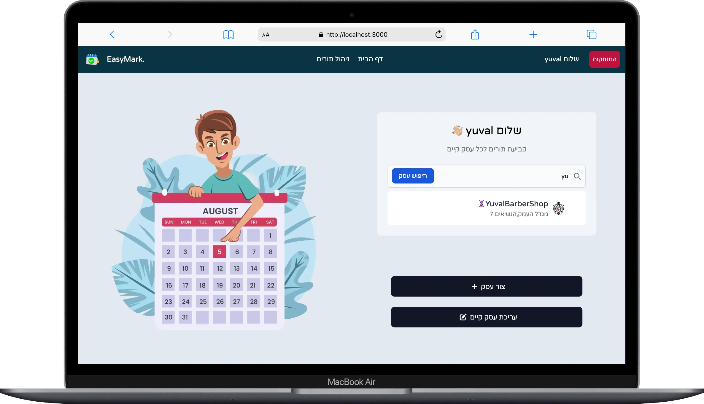

# 🗓️ EasyMark – Appointment Scheduling App

**EasyMark** is a full-stack appointment management platform built with **React.js**, **Redux**, **Node.js**, and **MongoDB**. It allows users to register/login, create a business profile, set working hours, manage appointments, and allow clients to book appointments seamlessly.

---

## ✨ Features

### 🔐 Authentication
- Secure login & registration system
- Validation and error handling
- Redux state management for user sessions

### 🏢 Business Management
- Create and manage a business profile
- Define business description, location, and services

### 🕒 Hours of Operation
- Set up daily or weekly availability
- Define time slots for appointment scheduling

### 📆 Appointment Scheduling
- View a calendar of upcoming appointments
- Book new appointments
- Filter and manage appointments per business

### 🖥️ Fully Responsive
- Optimized for mobile, tablet, and desktop

---

## ⚙️ Tech Stack

| Technology  | Purpose                     |
|-------------|-----------------------------|
| React.js    | Frontend UI                 |
| Redux       | State management            |
| Node.js     | Backend server              |
| Express.js  | API routing                 |
| MongoDB     | Database                    |
| TailwindCSS | Styling & responsive layout |
